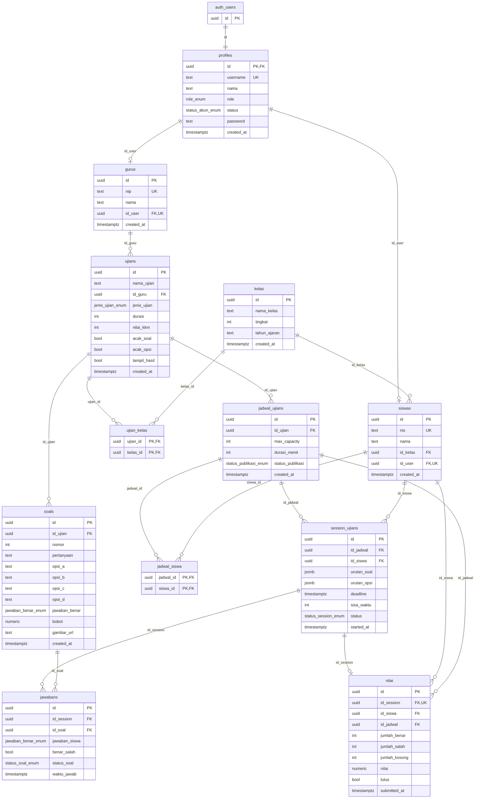

# Entity Relationship Diagram (ERD)
# Sistem ECBT — MTS Waha

> Database: PostgreSQL via Supabase  
> Dibuat: 15 Juli 2026

---

## Diagram Relasi (Mermaid)

---

## Deskripsi Tabel

### `auth.users` (GoTrue — Supabase Auth)
Tabel bawaan Supabase untuk autentikasi pengguna.

---

### `profiles`
Data profil pengguna, terhubung 1:1 dengan `auth.users`.

| Kolom | Tipe | Keterangan |
|---|---|---|
| `id` | uuid | PK, FK → auth.users |
| `username` | text | Unik |
| `nama` | text | Nama lengkap |
| `role` | role_enum | `admin`, `proktor`, `guru`, `siswa` |
| `status` | status_akun_enum | Default `aktif` |
| `password` | text | Opsional (plain/hash) |
| `created_at` | timestamptz | Default now() |

---

### `kelas`
Data kelas/rombongan belajar.

| Kolom | Tipe | Keterangan |
|---|---|---|
| `id` | uuid | PK |
| `nama_kelas` | text | Contoh: "X IPA 1" |
| `tingkat` | integer | 10, 11, atau 12 |
| `tahun_ajaran` | text | Contoh: "2025/2026" |
| `created_at` | timestamptz | Default now() |

---

### `siswas`
Data siswa, terhubung ke `profiles` dan `kelas`.

| Kolom | Tipe | Keterangan |
|---|---|---|
| `id` | uuid | PK |
| `nis` | text | Nomor Induk Siswa, unik |
| `nama` | text | Nama lengkap |
| `id_kelas` | uuid | FK → kelas |
| `id_user` | uuid | FK → profiles, unik |
| `created_at` | timestamptz | Default now() |

---

### `gurus`
Data guru, terhubung ke `profiles`.

| Kolom | Tipe | Keterangan |
|---|---|---|
| `id` | uuid | PK |
| `nip` | text | Nomor Induk Pegawai, unik |
| `nama` | text | Nama lengkap |
| `id_user` | uuid | FK → profiles, unik |
| `created_at` | timestamptz | Default now() |

---

### `ujians`
Master data ujian yang dibuat oleh guru.

| Kolom | Tipe | Keterangan |
|---|---|---|
| `id` | uuid | PK |
| `nama_ujian` | text | Judul ujian |
| `id_guru` | uuid | FK → gurus |
| `jenis_ujian` | jenis_ujian_enum | `UMBK`, `UAS`, `PAS`, `PTS`, `TRYOUT`, `LATIHAN` |
| `durasi` | integer | Menit, default 90 |
| `nilai_kkm` | integer | Default 75 |
| `acak_soal` | boolean | Default true |
| `acak_opsi` | boolean | Default true |
| `tampil_hasil` | boolean | Default false |
| `created_at` | timestamptz | Default now() |

---

### `ujian_kelas`
Junction table — many-to-many antara ujian dan kelas.

| Kolom | Tipe | Keterangan |
|---|---|---|
| `ujian_id` | uuid | PK, FK → ujians |
| `kelas_id` | uuid | PK, FK → kelas |

---

### `soals`
Butir soal per ujian. Saat ini hanya mendukung 4 opsi (A–D).

| Kolom | Tipe | Keterangan |
|---|---|---|
| `id` | uuid | PK |
| `id_ujian` | uuid | FK → ujians |
| `nomor` | integer | Urutan soal |
| `pertanyaan` | text | Teks soal |
| `opsi_a`–`opsi_d` | text | Pilihan jawaban |
| `jawaban_benar` | jawaban_benar_enum | `A`, `B`, `C`, `D`, `E` |
| `bobot` | numeric | Default 1 |
| `gambar_url` | text | Opsional |
| `created_at` | timestamptz | Default now() |

> **Catatan:** `jawaban_benar_enum` memiliki nilai `E`, namun kolom `opsi_e` tidak ada. Perlu ditambahkan kolom `opsi_e text` atau hapus nilai `E` dari enum.

---

### `jadwal_ujians`
Jadwal pelaksanaan ujian (sesi tertentu dari sebuah ujian).

| Kolom | Tipe | Keterangan |
|---|---|---|
| `id` | uuid | PK |
| `id_ujian` | uuid | FK → ujians |
| `max_capacity` | integer | Kapasitas peserta, default 40 |
| `durasi_menit` | integer | Durasi sesi ini |
| `status_publikasi` | status_publikasi_enum | Default `Draft` |
| `created_at` | timestamptz | Default now() |

---

### `jadwal_siswa`
Junction table — many-to-many antara jadwal ujian dan siswa peserta.

| Kolom | Tipe | Keterangan |
|---|---|---|
| `jadwal_id` | uuid | PK, FK → jadwal_ujians |
| `siswa_id` | uuid | PK, FK → siswas |

---

### `session_ujians`
Sesi aktif pengerjaan ujian oleh siswa.

| Kolom | Tipe | Keterangan |
|---|---|---|
| `id` | uuid | PK |
| `id_jadwal` | uuid | FK → jadwal_ujians |
| `id_siswa` | uuid | FK → siswas |
| `urutan_soal` | jsonb | Array ID soal setelah di-shuffle |
| `urutan_opsi` | jsonb | Map soal → urutan opsi setelah di-shuffle |
| `deadline` | timestamptz | Batas waktu pengerjaan |
| `sisa_waktu` | integer | Detik tersisa |
| `status` | status_session_enum | `belum_mulai`, `berlangsung`, `selesai`, `force_submit` |
| `started_at` | timestamptz | Default now() |

---

### `jawabans`
Jawaban siswa per soal dalam sebuah sesi.

| Kolom | Tipe | Keterangan |
|---|---|---|
| `id` | uuid | PK |
| `id_session` | uuid | FK → session_ujians |
| `id_soal` | uuid | FK → soals |
| `jawaban_siswa` | jawaban_benar_enum | Nullable (belum dijawab) |
| `benar_salah` | boolean | Nullable (belum diperiksa) |
| `status_soal` | status_soal_enum | `belum`, `sudah`, `ragu` |
| `waktu_jawab` | timestamptz | Default now() |

---

### `nilai`
Rekap nilai akhir setelah ujian selesai.

| Kolom | Tipe | Keterangan |
|---|---|---|
| `id` | uuid | PK |
| `id_session` | uuid | FK → session_ujians, unik |
| `id_siswa` | uuid | FK → siswas |
| `id_jadwal` | uuid | FK → jadwal_ujians |
| `jumlah_benar` | integer | Default 0 |
| `jumlah_salah` | integer | Default 0 |
| `jumlah_kosong` | integer | Default 0 |
| `nilai` | numeric | Skor akhir |
| `lulus` | boolean | Perbandingan nilai vs KKM |
| `submitted_at` | timestamptz | Default now() |

---

## Enum Types

| Enum | Values |
|---|---|
| `role_enum` | `admin`, `proktor`, `guru`, `siswa` |
| `status_akun_enum` | `aktif`, *(lainnya)* |
| `jenis_ujian_enum` | `UMBK`, `UAS`, `PAS`, `PTS`, `TRYOUT`, `LATIHAN` |
| `jawaban_benar_enum` | `A`, `B`, `C`, `D`, `E` |
| `status_publikasi_enum` | `Draft`, *(lainnya)* |
| `status_session_enum` | `belum_mulai`, `berlangsung`, `selesai`, `force_submit` |
| `status_soal_enum` | `belum`, `sudah`, `ragu` |

---

## Catatan & Isu Diketahui

| # | Isu | Lokasi | Rekomendasi |
|---|---|---|---|
| 1 | `opsi_e` tidak ada, padahal enum `jawaban_benar_enum` punya nilai `E` | `soals` | Tambahkan kolom `opsi_e text` atau hapus `E` dari enum |
| 2 | RLS policy `FOR ALL USING (true)` tidak efektif | Semua tabel | Buat policy berdasarkan `auth.uid()` dan `role` |
| 3 | Tidak ada migration system | Schema | Gunakan Supabase CLI migrations |
| 4 | `sisa_waktu` disimpan sebagai integer statis | `session_ujians` | Hitung dinamis dari `deadline - now()` agar akurat |
